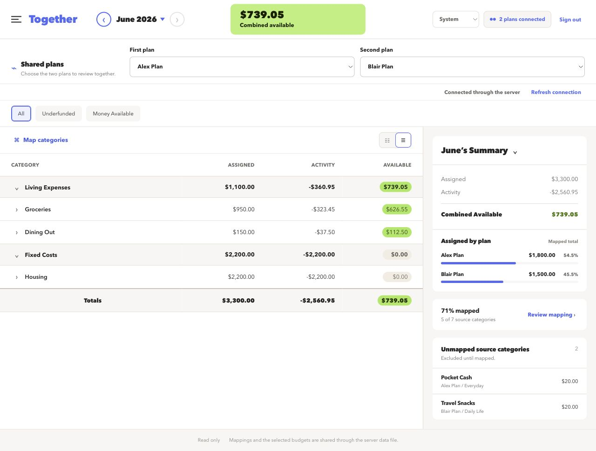

# Together Budget



_Dashboard shown with placeholder data._

## What it does

Together Budget is a small shared, read-only YNAB dashboard that combines two selected plans through manual category mappings.

The browser talks only to the included Node server. The server proxies the small set of YNAB `GET` endpoints the app needs, so the YNAB Personal Access Token is never included in the frontend bundle or sent to the browser.

## Privacy and data handling

- `YNAB_ACCESS_TOKEN` is read from the server environment at runtime.
- YNAB plan and budget responses are displayed but are not written to disk.
- Category mappings and the selected plan pair are stored in `data/together-budget.json` and shared by everyone using this deployment.
- The selected theme and chosen month stay in each browser's `localStorage` and are not shared. Months are remembered separately for each plan pair.
- That data file and its temporary atomic-write file are listed in `.gitignore`.
- `APP_PASSWORD` protects the budget APIs with a signed, HttpOnly session cookie.

Use HTTPS for any deployment reachable over a network so the shared password and session cookie are encrypted in transit. The app does not lock users out or rate-limit failed passwords; configure rate limiting at the reverse proxy if the login is internet-facing.

## Prerequisites

- Node.js 22 or newer and npm, or Docker
- A YNAB Personal Access Token

## Environment variables

| Variable | Required | Default | Purpose |
| --- | --- | --- | --- |
| `YNAB_ACCESS_TOKEN` | Yes | None | YNAB Personal Access Token used by the server-side read-only proxy. |
| `APP_PASSWORD` | Yes | None | Shared password required to access the application. |
| `SESSION_SECRET` | Recommended | Falls back to `APP_PASSWORD` | Signs session cookies. Changing it signs everyone out. |
| `SESSION_TTL_HOURS` | No | `168` | Session lifetime in hours. Invalid or non-positive values also fall back to 168 hours. |
| `COOKIE_SECURE` | No | `auto` | `true` always requires HTTPS cookies, `false` disables the `Secure` flag, and `auto` detects HTTPS. |
| `HOST` | No | `0.0.0.0` | Server bind address. |
| `PORT` | No | `3000` | Server listening port. |
| `DATA_FILE` | No | `data/together-budget.json` | Shared selected-budgets and mappings file. Docker defaults this to `/app/data/together-budget.json`. |
| `NODE_ENV` | No | Production-style behavior | Set to `development` to enable Vite middleware and hot reloading. Docker sets it to `production`. |

The app does not load `.env` files automatically. Export variables in the shell, provide them inline, or configure them through Docker or the hosting platform.

Complete production example:

```sh
YNAB_ACCESS_TOKEN=your-token \
APP_PASSWORD='a-long-shared-password' \
SESSION_SECRET='a-separate-long-random-secret' \
SESSION_TTL_HOURS=168 \
COOKIE_SECURE=auto \
HOST=0.0.0.0 \
PORT=3000 \
DATA_FILE=data/together-budget.json \
NODE_ENV=production \
npm start
```

## Run locally

Install dependencies:

```sh
npm install
```

Start the app with the YNAB token, shared password, and session-signing secret in the server environment:

```sh
YNAB_ACCESS_TOKEN=your-token \
APP_PASSWORD='a-long-shared-password' \
SESSION_SECRET='a-separate-long-random-secret' \
npm run dev
```

Open [http://localhost:3000](http://localhost:3000). The development server provides hot reloading while keeping the API and filesystem operations server-side.

The default data path is `data/together-budget.json`. Override it with `DATA_FILE=/absolute/path/to/file.json` if needed.

## Test and build

```sh
npm run test:run
npm run build
```

To run the production server without Docker:

```sh
NODE_ENV=production \
YNAB_ACCESS_TOKEN=your-token \
APP_PASSWORD='a-long-shared-password' \
SESSION_SECRET='a-separate-long-random-secret' \
npm start
```

## Docker

Build the image:

```sh
docker build -t ynab-together .
```

Export the secrets in your shell, then run the container with a persistent named volume:

```sh
export YNAB_ACCESS_TOKEN=your-token
export APP_PASSWORD='a-long-shared-password'
export SESSION_SECRET="$(openssl rand -hex 32)"
docker run --name ynab-together \
  --publish 3000:3000 \
  --env YNAB_ACCESS_TOKEN \
  --env APP_PASSWORD \
  --env SESSION_SECRET \
  --volume ynab-together-data:/app/data \
  ynab-together
```

The container runs as a non-root user, listens on port `3000`, and writes its data file to `/app/data/together-budget.json`. Keep the volume mounted across container replacements to retain mappings and the selected plan pair.

Sessions last seven days by default. Set `SESSION_TTL_HOURS` to change that duration. `SESSION_SECRET` is optional but strongly recommended; changing it signs everyone out. The app automatically marks cookies `Secure` when served over HTTPS. Set `COOKIE_SECURE=true` to require secure cookies explicitly.

## Mapping backup

Use **Export mapping** in the app to download a mapping backup. Use **Import mapping** to restore a mapping for the same selected plan pair. The app's server-side data file can also be backed up directly while the server is stopped.

## Progress tracking

Future agents and developers must read and update `TASKS.md` before and after each implementation step.
